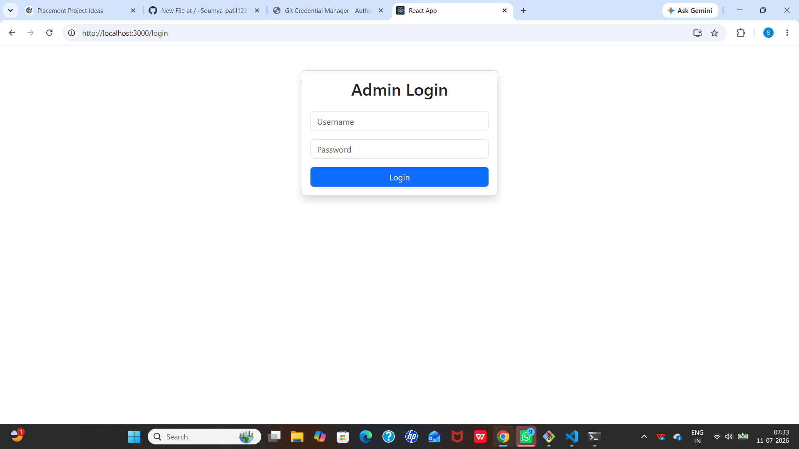
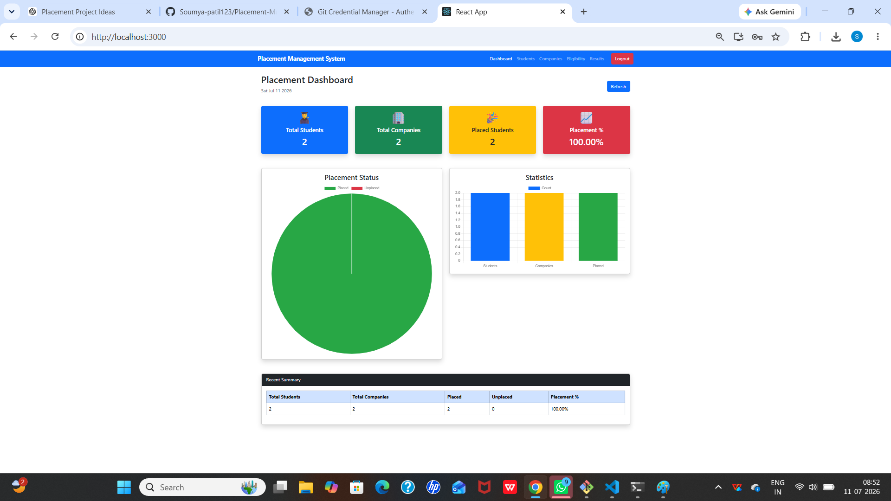
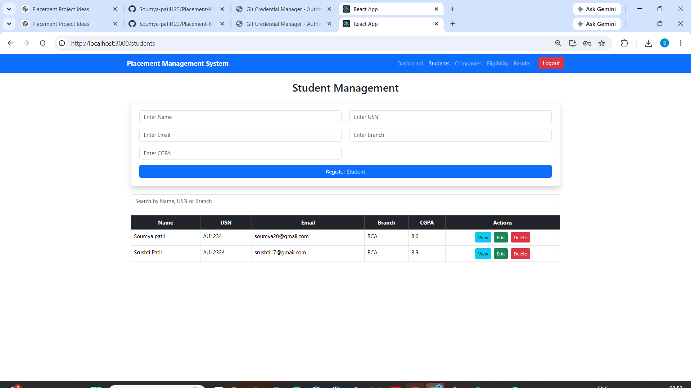
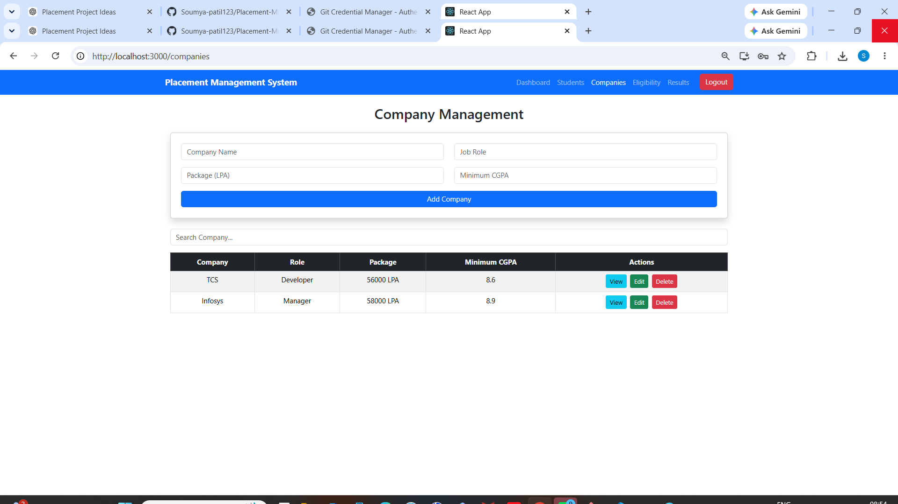
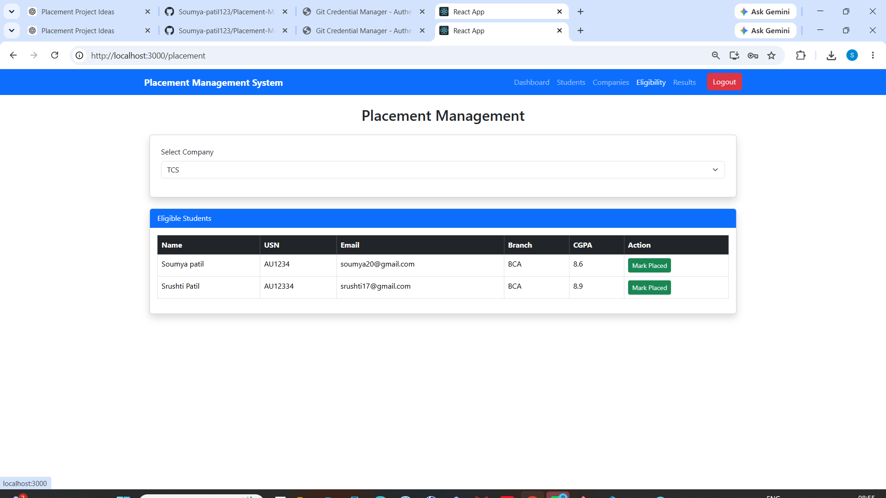
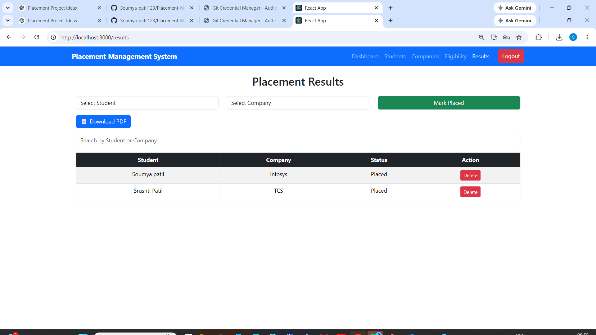

# Placement Management System

A full-stack Placement Management System developed using the MERN Stack to manage students, companies, eligibility, placements, and dashboard statistics.

## Features

- Student Management (Add, Update, Delete)
- Company Management
- Eligibility Checker
- Placement Results
- Dashboard with Statistics
- Search Functionality
- PDF Report Download

## Technologies Used

### Frontend
- React.js
- Bootstrap
- Axios

### Backend
- Node.js
- Express.js

### Database
- MongoDB
- Mongoose

## Project Structure

Placement-Management-System
│
├── frontend
├── backend
└── README.md

## Installation

### Backend

```bash
cd backend
npm install
npm start
```

### Frontend

```bash
cd frontend
npm install
npm start
```


## 📸 Screenshots

### Login Page


### Dashboard


### Student Management


### Company Management


### Eligibility


### Placement Results


## Author

**Soumya Patil**

BCA (Pursuing)

GitHub:
https://github.com/Soumya-patil123

## License

This project is for educational purposes.


